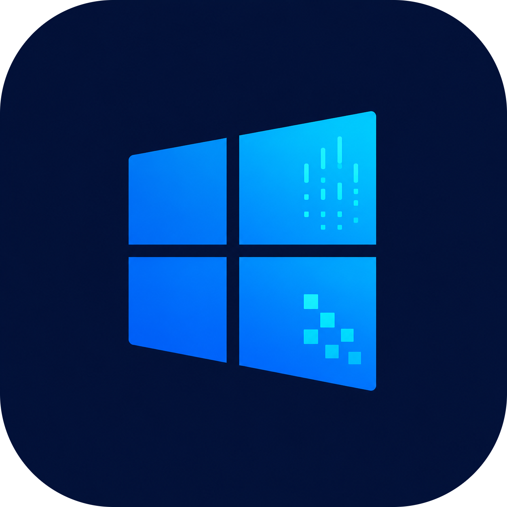

<div align="center">



# Windows-Analysis

수집한 Windows 아티팩트를 한 번에 파싱하고, 하나의 시간축에서 함께 보는 침해사고 분석 도구


</div>

---

수집 폴더를 지정하면 그 안에서 지원하는 증거 파일을 모두 찾아 한 번에 파싱하고, 아티팩트별 원본 표와 교차 상관된 분석 화면을 만듭니다. 분석가는 도구를 바꿔 가며 결과를 모으는 대신 한 화면에서 시간순으로 확인합니다.

## 지원하는 원본

수집 방식(FTK Imager, KAPE, 자체 수집 스크립트 등)과 폴더 구조에 관계없이, 지정한 폴더 아래 전체를 훑어 지원 대상 파일을 찾습니다. 어떤 파일을 어디서 찾았는지는 파싱 보고서에 남습니다.

| 분류 | 원본 |
| --- | --- |
| 레지스트리 | `SYSTEM` `SOFTWARE` `SAM` `SECURITY` `NTUSER.DAT` `USRCLASS.DAT` `Amcache.hve` (트랜잭션 로그 반영) |
| 이벤트 로그 | `.evtx` 전체, 구형 `.evt`(Security/System/Application) |
| 파일시스템 | `$MFT`, `$UsnJrnl($J)` |
| 실행 흔적 | Prefetch(`.pf`), Amcache, UserAssist, BAM, SRUM(`SRUDB.dat`), 작업 스케줄러 |
| 사용자 활동 | 점프리스트(`*.automaticDestinations-ms`·`*.customDestinations-ms`, 내부 LNK 포함), ShellBag, RDP 비트맵 캐시, PowerShell 콘솔 기록, Windows 타임라인 |
| 브라우저 | Chromium 계열(Chrome·Edge·Whale) 방문·다운로드·캐시 본문, IE `WebCacheV01.dat`·`index.dat` |
| 기타 | WMI 저장소(영구 구독), WER 오류 보고서, Defender 로그 |

깨진 파일은 읽을 수 있는 레코드까지 파싱하고, 실패한 파일은 무엇이 왜 실패했는지 목록으로 남깁니다. 하나가 실패해도 나머지 파싱은 계속됩니다.

## 통합 분석 화면

파싱이 끝나면 아래 화면이 미리 만들어져 있어 클릭 즉시 열립니다.

| 화면 | 무엇을 보여 주나 | 근거 |
| --- | --- | --- |
| 통합 타임라인 | 모든 아티팩트를 하나의 시간축에 정렬 | 전체 |
| 호스트 정보 | OS·계정·네트워크·공유·설치 정보 | 레지스트리 |
| 실행 이력 | 실행 파일 하나에 대한 모든 실행 근거를 한 줄로 | Prefetch·Amcache·UserAssist·BAM·SRUM |
| 원격 접근 | RDP·SMB 접속 기록과 호스트 간 연결 관계 | 이벤트 로그·레지스트리 |
| 브라우저 활동 | 방문·다운로드·캐시 본문, AI 대화 내용 | 브라우저 DB·캐시 |
| 지속성 | 자동 실행, 서비스, 작업 스케줄러, WMI 구독 | 레지스트리·작업·WMI |
| 안티바이러스 | 탐지·격리·설정 변경 이력 | Defender 이벤트·로그 |

## 의심 항목 필터

레코드마다 DFIR 관점의 규칙을 적용해 위험 신호를 표시하고, 표시된 항목만 남기는 필터를 모든 목록과 타임라인에서 제공합니다.

| 규칙 예 | 표시 |
| --- | --- |
| LOLBin 실행 — `powershell` `rundll32` `regsvr32` `mshta` `certutil` | 위험 |
| 파일 이름과 PE 내부 이름 불일치(위장) | 위험 |
| 인코딩·다운로드 크래들·창 숨김 PowerShell (`-enc`, `DownloadString`, `-w hidden`) | 위험 |
| 감사 로그 삭제(1102), 감사 정책 변경(4719) | 위험 |
| Defender 검사 비활성화(5010·5012), 위협 탐지(1006·1015) | 위험 |
| 명시적 자격 증명 로그온(4648), 로그온 실패 반복(4625) | 주의 |
| 임시·다운로드·Public·ProgramData 폴더에서 실행 | 주의 |
| 숨김 작업 스케줄러, 의심 경로에서 실행되는 작업 | 주의 |

## 사용 순서

1. 배포 파일을 내려받아 실행합니다(Windows는 실행 파일 하나, macOS는 `.dmg`). 별도 설치·설정이 없습니다.
2. 분석할 수집 폴더를 지정하고 호스트 이름을 정합니다.
3. 파싱을 실행합니다. 진행 상황과 아티팩트별 결과 건수가 화면에 표시됩니다.
4. 왼쪽 목록에서 화면을 선택해 분석합니다. 사고 기간 필터는 모든 화면에 함께 적용되고, 중요한 행은 북마크로 모아 볼 수 있습니다.

<div align="center">


</div>

## 데이터 취급

- 수집한 원본 파일은 읽기만 합니다. 원본을 수정하거나 이동하지 않습니다.
- 분석 결과와 앱이 만드는 모든 파일은 실행 파일 옆 `cases/` 안에만 생깁니다. 폴더를 지우면 흔적이 함께 사라집니다.
- 외부로 데이터를 전송하지 않습니다. 네트워크 통신 기능이 없습니다.
- 삭제된 레코드는 복구하지 않습니다. 현재 유효한 데이터만 근거로 씁니다.

```
cases/
└── WORKSTATION-01/          호스트 하나
    ├── REGISTRY/  EVENTLOG/  FILESYSTEM/  BROWSER/  ...   원본 그대로의 파싱 결과
    ├── _OVERVIEW/                                         분석 화면용 가공 결과
    └── parse_report.json                                  파일별 파싱 결과·실패 내역
```
